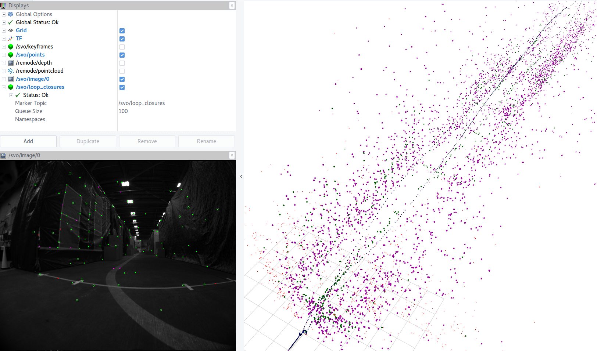

In this document, we will see how to use `SVO` with stereo setup and IMU information. We will also see how to adapt the parameters for a different resolution.

Let's start with an example first. Download the dataset from http://rpg.ifi.uzh.ch/datasets/fla_stereo_imu.bag. This bag file contains synchronized stereo images and IMU measurements. You can run `SVO` on this bag by

    roslaunch svo_ros fla_stereo_imu.launch
    rosbag play fla_stereo_imu.bag

You should be able to observer the output similar to 

Now we will go through important things that need to be specified.

### The calibration file
#### Stereo
The calibration file for stereo cameras (e.g., `param/fla_stereo_imu.yaml`) would look like this:

    cameras:
    - camera:
        <distortion and intrinsics>
      T_B_C:
        cols: 4
        rows: 4
        data: [0.99984983, -0.00373198,  0.01692284,  -0.074783895,
               0.00403133,  0.9998354 , -0.01768969,  -0.0005     ,
              -0.01685403,  0.01775525,  0.9997003 ,  -0.0041,
               0.        ,  0.        ,  0.        ,  1.        ]
        <......>
    - camera:
        distortion:
          <distortion and intrinsics>
      T_B_C:
        cols: 4
        rows: 4
        data: [0.99746136, -0.00394329, -0.07110054, 0.074783895,
               0.00236645,  0.99974967, -0.02224833, 0.0005,
               0.07117047,  0.02202359,  0.997221  , 0.0041,
               0.        ,  0.        ,  0.        ,  1.       ]
      <......>
    label: fla_forward_stereo

`T_B_C`s are the transformations of the camera in the body frame, and the body frame is usually defined the same as the IMU frame (see notations [here](https://github.com/uzh-rpg/rpg_svo/wiki/Notation)).

#### IMU
To use IMU measurements, IMU noise characteristics/initial values need to be specified:

    imu_params:
      delay_imu_cam: 0.0
      max_imu_delta_t: 0.01
      acc_max: 176.0
      omega_max: 7.8
      sigma_omega_c: 0.005
      sigma_acc_c: 0.01
      sigma_omega_bias_c: 4.0e-6
      sigma_acc_bias_c: 0.0002
      sigma_integration: 0.0
      g: 9.81007
      imu_rate: 200.0

    imu_initialization:
      velocity: [0, 0, 0]
      omega_bias: [0, 0, 0]
      acc_bias: [0, 0, 0]
      velocity_sigma: 0.5
      omega_bias_sigma: 0.005
      acc_bias_sigma: 0.05

Most importantly are the noise characteristics `sigma_omega_c`, `sigma_acc_c`, `sigma_omega_bias_c` and `sigma_acc_bias_c`, which are the continuous time noise sigma for additive noise and bias random walk.
For a good description of IMU noise model, see [this page](https://github.com/ethz-asl/kalibr/wiki/IMU-Noise-Model).

To calibrate the extrinsics and/or the intrinsics of the IMU-camera system, we recommend to use [Kalibr](https://github.com/ethz-asl/kalibr). Please refer to the manual of the package for more details.
We have a script (`scripts/kalibr_to_svo.py`) to convert the output of `Kalibr` to `SVO`.
In practice, we sometimes find that the translation components between the IMU and cameras are not well calibrated (probably due to the lack of excitation of the accelerometers), therefore it is better to double check your calibration result before using.

### The launch file
You need to specify the camera and IMU topics in the launch file (e.g., `launch/fla_stereo_imu.launch`) as:

    <param name="cam0_topic" value="/sync/cam0/image_raw" type="str" />
    <param name="cam1_topic" value="/sync/cam1/image_raw" type="str" />
    <param name="imu_topic" value="/sync/imu/imu" type="str" />

### The parameters
#### Stereo
To use stereo, you need to specify the following in your parameter file:

    pipeline_is_stereo: True
    automatic_reinitialization: True # When lost, stereo can recover immediately

The following parameters are also important:

    max_depth_inv: 0.05
    min_depth_inv: 2.0
    mean_depth_inv: 0.3

These parameters affect the range of epipolar search for triangulation. It is usually OK to use the default range, but if your application scenario is very different, please adapt it accordingly.
Another thing we can do in a stereo setup is to use multi-thread for reprojecting features

    use_async_reprojectors: True

#### IMU
In `SVO`, IMU measurements are mostly used for providing a rotational prior for image alignment and pose optimization.
This is especially important for image alignment under aggressive motion (e.g., in the example bag), since the optimization needs a good initialization.
To use IMU measurements, you need to specify the following

    use_imu: True
    img_align_prior_lambda_rot: 5.0 # Gyroscope prior in sparse image alignment
    poseoptim_prior_lambda: 2.0 # Gyroscope prior in pose optimization

The higher the prior lambdas are, the more weight the IMU priors have. If you have a good IMU, you can set them higher and vice versa. If `use_imu` is set to false and the prior lambdas are nonzero, a constant velocity prior will be used, which often does not perform very well in practice. Therefore remember to set the prior lambdas to zero when IMU is not used.

#### Image Resolutions
The image resolution from the example bag is `1280x1040`. Therefore you can see some different parameters in `fla_stereo_imu.yaml` and `pinhole.yaml`, which is suited for `752x480`. Most notably are

    img_align_max_level: 5  # maximum pyramid level for the coarse-to-fine optimization
    n_pyr_levels: 4         # create more pyramid levels for large images, it is  always image align max level minus one

    grid_size: 50           # use a bigger grid for feature bucketing for larger images
    poseoptim_thresh: 3.0   # outlier threshold in pixel, should be higher for larger images

    init_min_disparity: 30  # minimum disparity for monocular initialization, should be higher for larger images
